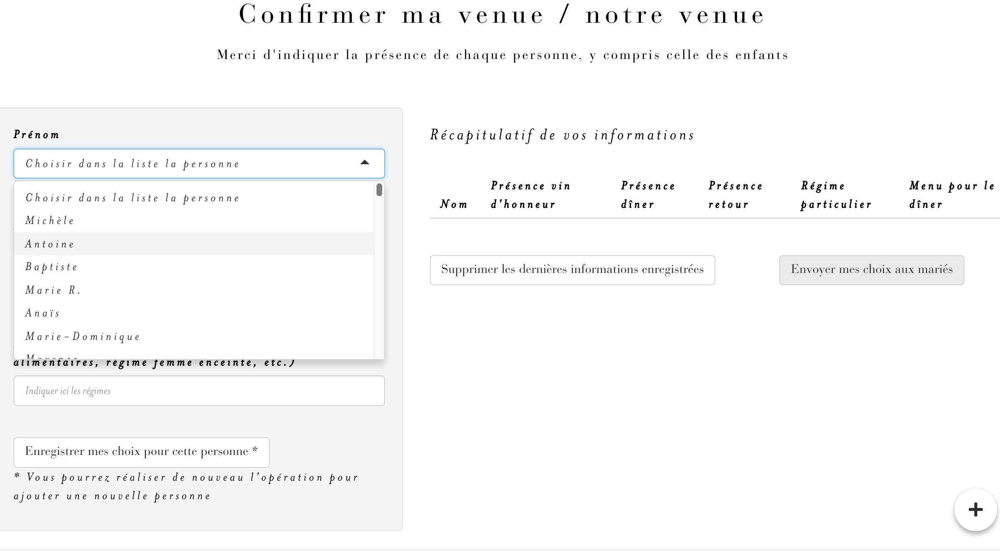
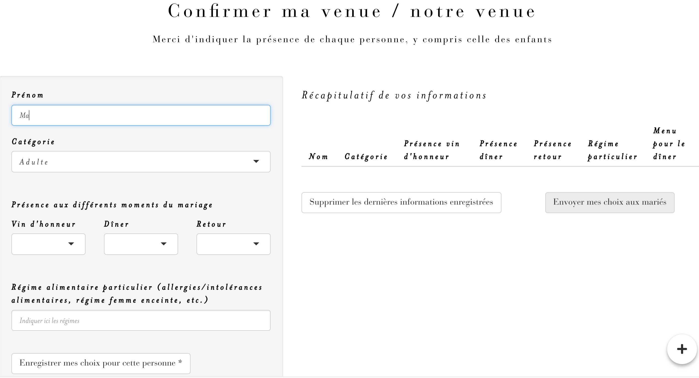

<!-- README.md is generated from README.Rmd. Please edit that file -->

```{r, include = FALSE}
knitr::opts_chunk$set(
  collapse = TRUE,
  comment = "#>",
  fig.path = "man/figures/README-",
  out.width = "100%"
)
library(emo)
```

# wedding 

<!-- badges: start -->
[](https://github.com/ThinkR-open/wedding/actions)
[](https://lifecycle.r-lib.org/articles/stages.html#experimental)
<!-- badges: end -->

{wedding} helps you to prepare and manage your wedding `r emo::ji("bride_with_veil")``r emo::ji("bride_with_veil")` - `r emo::ji("bride_with_veil")``r emo::ji("man_in_tuxedo")` - `r emo::ji("man_in_tuxedo")``r emo::ji("man_in_tuxedo")`

## Demo

An example of the app is available here: http://connect.thinkr.fr/wedding

Login to access the app: _welcome_ <br />
Password to access the app: _bigday_ <br />
Password to access the tab dedicated to brides/grooms: _onlyforbride_

```{r echo=FALSE}
knitr::include_graphics("man/figures/home-page.png")
```

You will find below how to run this demo app from RStudio Cloud.

## Highlights

- Secure access via a login and password authentication system
- Information about the wedding day (schedule, accomodation, etc.)
- RSVP feature where guests can specify their presence at the different times of the wedding, their choice for the diner menu and their diet - 2 types of RSVP features are proposed here (see additional details in the RSVP feature section of this README)
- Dashboard - only accessible with login and password - where bride/grooms can manage the preparations for their wedding (guests, expenses, table plan)
- Data stored in Google sheets
- Design in line with the wedding announcement (colors, fonts, etc.)

## Meaning of the tabs

- *Accueil*: Home
- *Confirmer ma venue*: Confirm my presence
- *Programme de la journée*: Program of the day
- *Lieu du mariage*: Location of the wedding
- *Hébergements*: Accommodations
- *Témoins*: Witnesses
- *Covid*: Covid rules
- *Espace des mariés*: Groom's area (expenses, guests, menu, `{ggplot2}` seating plan)

```{r echo=FALSE}
knitr::include_graphics("man/figures/seating-plan-page.png")
```

## Data

The application is based on two datasets stored on Google Drive. They will be **updated according to the user's navigation in the app**.

```{r echo=FALSE, out.width='70%', fig.align='center'}
knitr::include_graphics("man/figures/data-examples.png")
```

- **data_guests**: contains information about your guests (name, attendance at the vin d'honneur, attendance at the dinner, attendance at the return on Sunday lunch, special diet, etc.).
- **data_expenses**: contains information about the wedding expenses (venue, caterer, groom's outfit, wedding rings, etc.)

Structure of the datasets can be explored with:

``` r
# Install and load {wedding} package
# install.packages("remotes")
remotes::install_github("ThinkR-open/wedding")
library(wedding)

# View data_expenses
data("data_expenses_example")
data_expenses_example

# View data_guests
data("data_guests_example")
data_guests_example
```

Raw toy datasets can be accessed directly here: 

- [**data_guests**](https://docs.google.com/spreadsheets/d/1uCENmsM7XEcqE_ae80uYUMU6EA_-ozKqHyGJXHJHDiU/edit?usp=sharing)
- [**data_expenses**](https://docs.google.com/spreadsheets/d/1Mb6QPB2G2Msy-K9xnU6Cs8qJ32i5eMdTvY9hh1mJwKw/edit?usp=sharing)

## RSVP feature

2 types of features are proposed here :

- You can create your guest list beforehand. Your spreadsheet is pre-filled. The guests will be asked to select their first name from a **drop-down list**. *This is the default feature for the app.*

```{r echo=FALSE, out.width='70%', fig.align='center'}

```

- Or you do not create your guest list beforehand. At the beginning, your spreadsheet is empty. In this case, the guests will be asked to indicate their first name in a **free text zone**. You will need to go to the spreadsheet regularly to associate guests to a table in your seating plan. 

```{r echo=FALSE, out.width='70%', fig.align='center'}

```

<br/>

#### To use the non pre-filled list and the free text zone:

- Define an extra environment variable: 
``` r
Sys.setenv(USE_PREFILLED_DATA_GUEST = "no")
```

- Call your spreadsheet in Google Drive **data_guests_not_pre_filled**, not *data_guests* (default). A raw toy dataset can be accessed directly here: [**data_guests_not_pre_filled**](https://docs.google.com/spreadsheets/d/1qJo_UiHx0qjjqEncT2NCYAoFMycozKxrShGcun7Qokw/edit?usp=sharing)

## Run the demo app from RStudio Cloud

- Save the two toy datasets (see above) in your Google Drive storage
- Acess the project stored in RStudio Cloud: https://rstudio.cloud/project/2548794
- In Git tab, check that you are in the *main* branch and pull the latest version of the branch
- Install `{wedding}`

``` r
remotes::install_github("ThinkR-open/wedding")
```

- Create environment variables mandatory for the app

``` r
Sys.setenv(GOOGLE_MAIL = "wedding.r.package@gmail.com") # Replace wedding.r.package@gmail.com by your gmail adress
Sys.setenv(LOGIN_USER = "welcome")
Sys.setenv(PWD_USER = "bigday")
Sys.setenv(PWD_COUPLE = "onlyforbride")
Sys.setenv(IMG_BACKGROUND = "wedding-background-demo-compressed.jpg")
```

- Create and store the credentials for Google account - A popup will open, and you will be asked to write your password - This will create a token and will store it in a .secrets folder

``` r
# install.packages(c("gargle", "googledrive"))
options(gargle_oauth_cache = ".secrets")
options(gargle_verbosity = "debug")
googledrive::drive_auth(cache = ".secrets", 
                        email = Sys.getenv("GOOGLE_MAIL"))
```

- Run the demo app

``` r
wedding::run_app()
```

